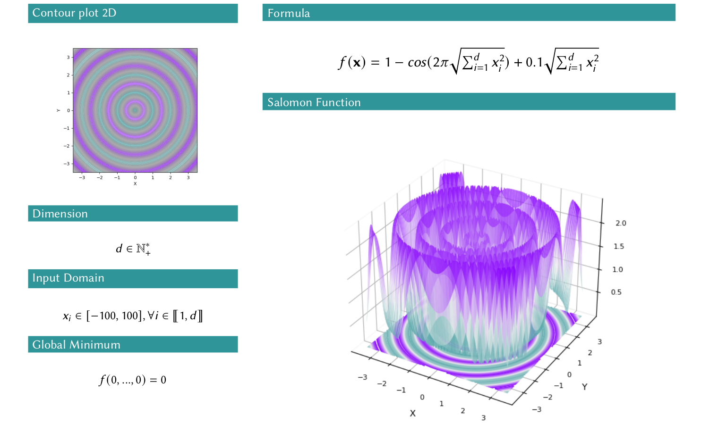
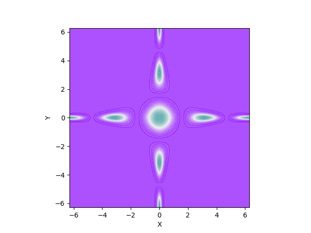
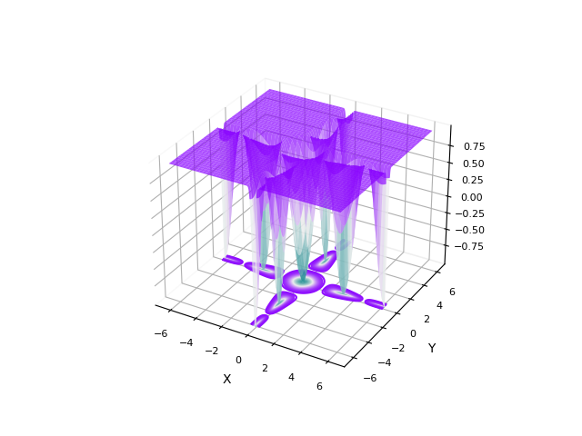
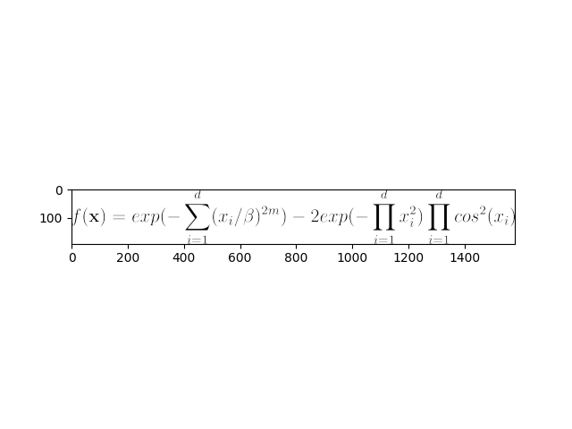

# Python_Benchmark_Test_Optimization_Function_Single_Objective

Here a repository where you can find and easy access python implementation of a benchmark of function to test optimizations for single objective optimization.
You can download or fork the repository freely. If you see a mistake you can send me a mail at axel.arcueil@gmail.com or contact me on [LinkedIn](https://www.linkedin.com/in/axel-thevenot/).

## Available functions documentation

You can find the full documentation [on this article](https://towardsdatascience.com/optimization-eye-pleasure-78-benchmark-test-functions-for-single-objective-optimization-92e7ed1d1f12?sk=9183bfff85db523dbee1237d86c524cf) for all the functions as you can see on the image above. 



## Easy Use

### One-liner access: Filter the functions with their characteristics

```python
import pybenchfunction as bench
# get all the available functions accepting ANY dimension
any_dim_functions = bench.get_functions(None)
# get all the available continuous and non-convex functions accepting 2D
continous_nonconvex_2d_functions = bench.get_functions(
    2,  # dimension
    continuous=True,
    convex=False,
    separable=None,
    differentiable=None,
    mutimodal=None,
    randomized_term=None
)
print(len(any_dim_functions))  # --> 40
print(len(continous_nonconvex_2d_functions))  # --> 41
```

### Import specific function


```python
# set the dimension of the input for the function
sphere = bench.function.Sphere(3)
# get results
X = np.array([1, 3, 0])
print(sphere(X))  # --> 10
```

### Plot 2d or plot 3d contours

```python
# Warning ! Only working on 2d functions objects !
# Warning 2! change n_space to reduce the computing time
thevenot = bench.function.Thevenot(2)
bench.plot_2d(thevenot, n_space=1000, ax=None)
bench.plot_3d(thevenot, n_space=1000, ax=None)
```



### Access/change the parameters of parametrics functions

```python
print(thevenot.get_param())  # --> {'m': 5, 'beta': 15}
thevenot.beta = 42
print(thevenot.get_param())  # --> {'m': 5, 'beta': 42}
```

### Get the global minimum for a specific dimension

```python
X_min, minimum = sphere.get_global_minimum(3)
print(X_min)  # --> [0 0 0]
print(minimum)  # --> 0
```

### Acces/plot the latex formulas

```python
latex = bench.function.Thevenot.latex_formula
# latex = bench.function.Thevenot.latex_formula_dimension
# latex = bench.function.Thevenot.latex_formula_input_domain
# latex = bench.function.Thevenot.latex_formula_global_minimum
print(latex)  # --> f(\mathbf{x}) = exp(-\sum_{i=1}^{d}(x_i / \beta)^{2m}) - 2exp(-\prod_{i=1}^{d}x_i^2) \prod_{i=1}^{d}cos^ 2(x_i)
latex_img = bench.latex_img(latex)
# convert the latex formula to image
plt.imshow(latex_img)
plt.show()
```


## Uniform implementation

All the functions are Classes implemented in the same way. Here the Sphere example:

```python
class Sphere:
    name = 'Sphere'
    latex_formula = r'f(\mathbf{x})=\sum_{i=1}^{d} x_i^{2}'
    latex_formula_dimension = r'd \in \mathbb{N}_{+}^{*}'
    latex_formula_input_domain = r'x_i \in [-5.12, 5.12], \forall i \in \llbracket 1, d\rrbracket'
    latex_formula_global_minimum = r'f(0, ..., 0)=0'
    continuous = True
    convex = True
    separable = True
    differentiable = False
    mutimodal = False
    randomized_term = False
    parametric = False

    @classmethod
    def is_dim_compatible(cls, d):
        assert (d is None) or (isinstance(d, int) and (not d < 0)), "The dimension d must be None or a positive integer"
        return  (d is None) or (d  > 0)

    def __init__(self, d,):
        self.d = d
        self.input_domain = np.array([[-5.12, 5.12] for _ in range(d)])

    def get_param(self):
        return {}

    def get_global_minimum(self, d):
        X = np.array([0 for _ in range(d)])
        return (X, self(X))

    def __call__(self, X):
        d = X.shape[0]
        res = np.sum(X**2)
        return res
```

